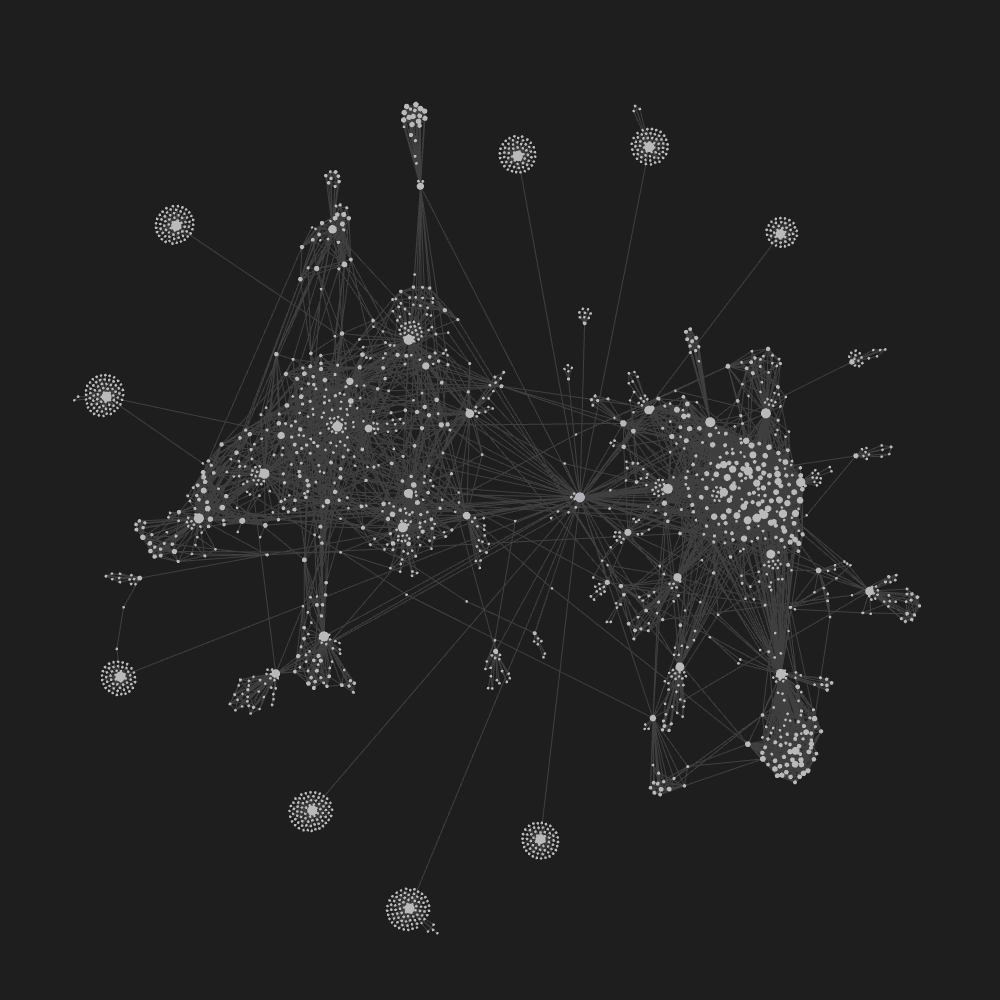
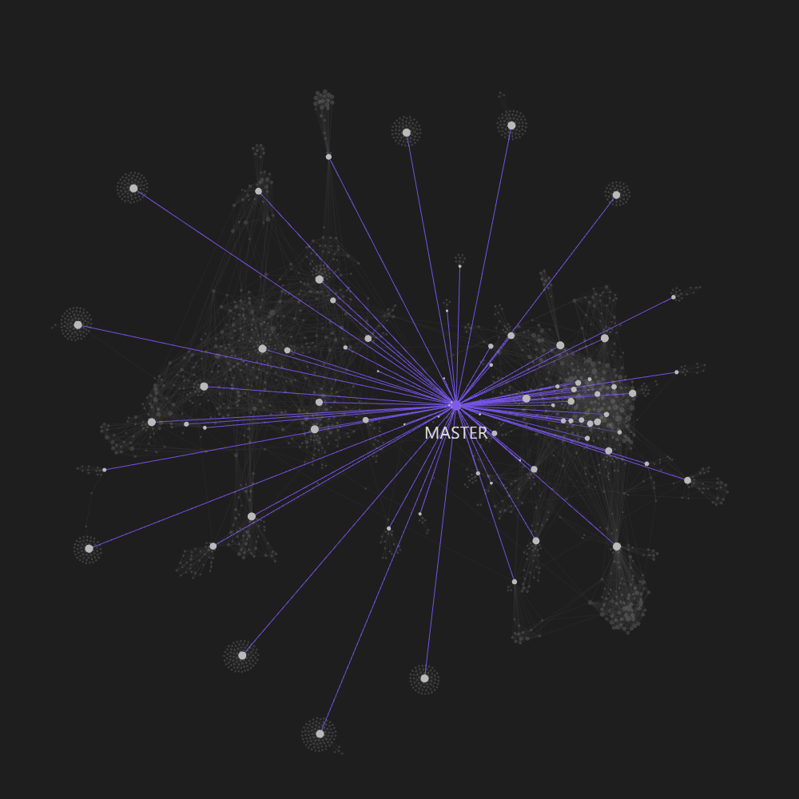
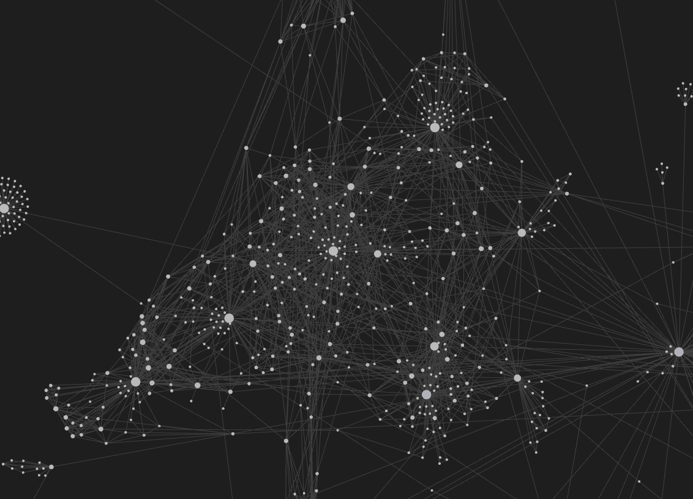
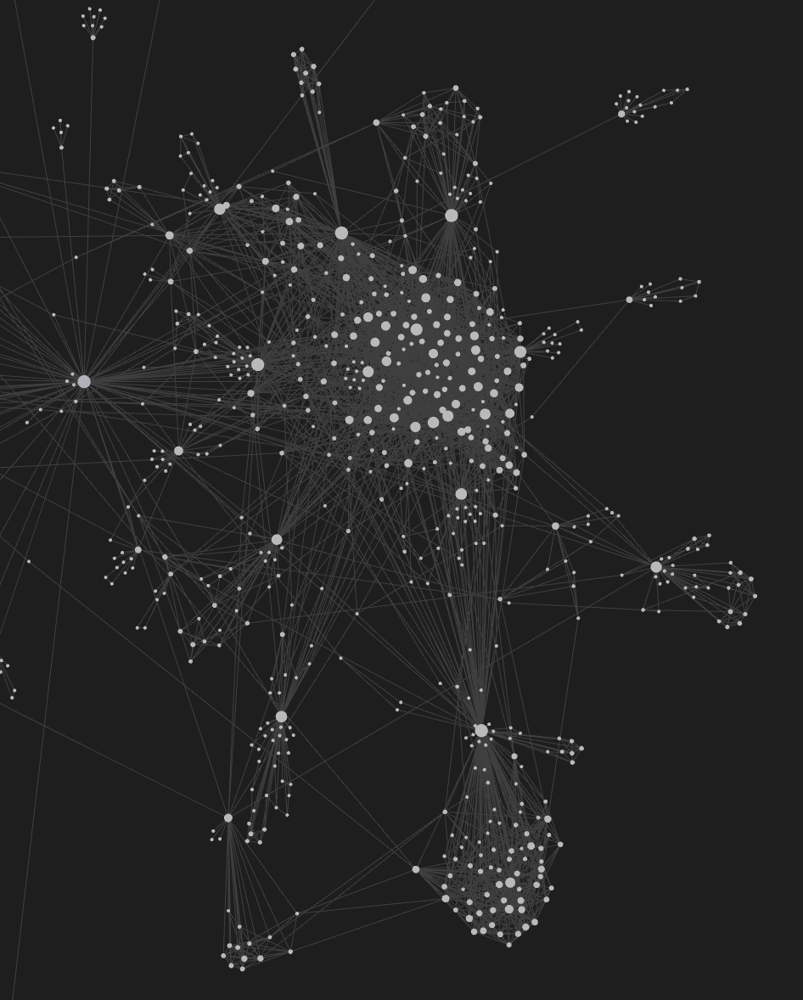

# FollowerOfMyFollower

我的粉丝的粉丝

## 简介

这个项目起因是过年的时候闲着无聊突发奇想：能不能通过公开的数据来构建一下我的社交网络，并且通过这个网络来找到一些我没有关注的现实中朋友的微博账号。

对于一个普通微博用户，关注的量级往往要比被关注的多，并且被关注的关系更可能来自现实世界认识的人。
因为懒，项目没有使用微博的 API ，只是对微博的 WAP 网页简单的爬虫，只能获取前十页的粉丝数据，但是一个普通用户，能有十页的粉丝也差不多了。

项目逻辑非常简单，从某一个账号微博开始，爬取两层粉丝的粉丝，记录下这些用户数据和单向的关注关系。

然后筛出掉没有出度的边缘节点，剩下的就是核心关系网络，因为我懒得用其他的知识图谱的工具，就用了 [Obsidian](https://obsidian.md) 的关系网络功能，创建双链的逻辑和微博的关注是一样的。
通过生成的一堆 md 文件，用 Obsidian 打开对应的文件夹就可以看到关系网络了。

## Demo

最终的效果图为

我在其中的关系是

左边这片网是我大学的关系

右边这片网是我在家乡小镇的关系

那些在这两片网中但是没和我有关注关系的大概率就是我现实中认识但是没关注的人。

## 小结

有一说一，这种300行代码不到、大学生课后作业级别的项目都能构建这样复杂的网络，大公司根据更详细的信息肯定比我这个理得还要清楚，任何一家社交网络都是这样。

🤪🤪🤪